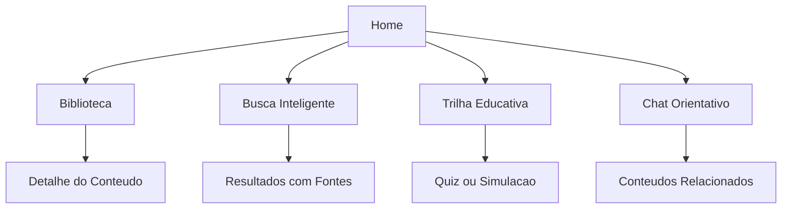

# Plano Byst.end MVP

## Direção Recomendada

Construir um MVP competitivo em uma stack simples para hackathon: **Next.js + TypeScript** no frontend, **API routes ou backend Node/Express separado** conforme exigência de separação, **SQLite com Prisma** para persistência local e **OpenAI ou provider compatível** para chat/busca com contexto controlado. Para maximizar velocidade e organização, eu recomendo um monorepo com `apps/web`, `apps/api`, `packages/shared` e `prisma`.

Base inicial ampliada: os CSVs fornecidos cobrem vídeos, estrutura metodológica, camadas/temas, nano/microconteúdos, calendário sazonal e slogans. Isso permite que o MVP pareça uma plataforma educacional de verdade, não apenas uma biblioteca de links.

- [Vídeos](c:/Users/lrzezak/Downloads/V%C3%8DDEOS,%20NANO%20E%20MICRO%20CONTE%C3%9ADOS%20EDUCATIVOS.xlsx%20-%201.%20V%C3%8DDEOS%20(PALESTRAS,%20WEBINARES.csv): 15 links de palestras/webinars sobre assédio moral, assédio sexual, microagressões, discriminação e saúde mental.
- [Estrutura Nano e Micro](c:/Users/lrzezak/Downloads/V%C3%8DDEOS,%20NANO%20E%20MICRO%20CONTE%C3%9ADOS%20EDUCATIVOS.xlsx%20-%202.1.%20ESTRUTURA%20NANO%20E%20MICRO%20CON.csv): matriz de públicos, violências, 8 camadas educacionais, temas, sensibilidade e risco jurídico.
- [Camadas e Temas](c:/Users/lrzezak/Downloads/V%C3%8DDEOS,%20NANO%20E%20MICRO%20CONTE%C3%9ADOS%20EDUCATIVOS.xlsx%20-%202.2.%20CAMADAS%20E%20TEMAS.csv): conteúdos prontos por linha com 7 nanos, micro/mídia e classificação.
- [Nano Conteúdos](c:/Users/lrzezak/Downloads/V%C3%8DDEOS,%20NANO%20E%20MICRO%20CONTE%C3%9ADOS%20EDUCATIVOS.xlsx%20-%202.3.%20NANO%20CONTE%C3%9ADOS.csv): programação de 14 meses por semana, nano cards e texto orientador de microconteúdo.
- [Conteúdos Sazonais](c:/Users/lrzezak/Downloads/V%C3%8DDEOS,%20NANO%20E%20MICRO%20CONTE%C3%9ADOS%20EDUCATIVOS.xlsx%20-%202.4.%20CONTE%C3%9ADOS%20SAZONAIS.csv): datas educativas e campanhas, incluindo Carnaval, visibilidade trans, combate à LGBTfobia, assédio eleitoral e saúde mental.
- [Slogans](c:/Users/lrzezak/Downloads/V%C3%8DDEOS,%20NANO%20E%20MICRO%20CONTE%C3%9ADOS%20EDUCATIVOS.xlsx%20-%202.5%20SLOGANS.csv): frases curtas por tema para cards, banners, feedbacks de quiz e chamadas de trilha.

## Produto Demonstrável

A jornada principal deve ser: entrar na Home, escolher entre aprender, buscar ou conversar, consumir conteúdos em cards, seguir uma trilha curta, responder quiz/simulação e usar o chat orientativo para dúvidas hipotéticas.

Telas principais:

- **Home**: proposta da Byst.end, aviso de responsabilidade e atalhos para Biblioteca, Trilha, Chat e Quiz.
- **Biblioteca**: cards de vídeos, nanos, microconteúdos e conteúdos sazonais, com filtros por tema, camada, tipo, público, sensibilidade e risco.
- **Busca Inteligente**: busca por palavra-chave no MVP, com arquitetura preparada para embeddings; retorna conteúdos e fontes.
- **Trilha Educativa**: sequência baseada nas 8 camadas, por exemplo “Reconhecer sinais e agir com responsabilidade”.
- **Quiz/Simulações**: perguntas como “isso merece atenção?” com feedback educativo, sem julgamento definitivo.
- **Chat Orientativo**: resposta empática, contextualizada, com fontes relacionadas e disclaimer claro.
- **Admin simples opcional**: cadastro/edição de conteúdos e perguntas se houver tempo.

Fluxo sugerido:

## Modelo de Dados

Entidades mínimas:

- `Content`: título, URL, tipo (`video`, `nano`, `micro`, `seasonal`, `slogan`), tema, resumo, tags, público, sensibilidade, risco jurídico, fonte, texto indexável.
- `Category`: assédio moral, assédio sexual, microagressões, discriminação, importunação sexual, estupro, violência digital, cultura de respeito.
- `EducationLayer`: as 8 camadas do processo evolutivo: conhecimento básico, diferenciação de limites, reconhecimento de condutas, impacto/consequências, responsabilidades, orientação à vítima, papel das testemunhas e prevenção contínua.
- `NanoContent`: os 7 cards curtos associados a um tema/camada.
- `MicroContent`: texto orientador mais longo associado aos nanos.
- `SeasonalContent`: data/período, tema sazonal, mensagem única e nanos opcionais.
- `Slogan`: frase curta por categoria para UI, reforço educativo e feedback.
- `LearningPath`: trilhas educativas com ordem dos conteúdos, podendo seguir camadas, semanas ou temas.
- `QuizQuestion`: pergunta, alternativas, resposta recomendada, explicação, camada e conteúdos relacionados.
- `UserProgress`: progresso local ou persistido por sessão anônima.
- `ChatSession` e `ChatMessage`: histórico mínimo, sem dados pessoais sensíveis por padrão.

Os CSVs entram via seed estruturado. O importador deve preservar os campos originais como metadados, normalizar nomes de temas/camadas, remover dependência de emojis para busca textual e gerar um campo `searchText` combinando título, tema, nanos, microconteúdo, risco e slogans. Não devemos inventar políticas internas, canais oficiais específicos ou pareceres jurídicos.

## Estratégia de Conteúdo

Usar a base em três níveis:

- **Nível rápido**: slogans e nanos para cards curtos, carrosséis e feedbacks imediatos.
- **Nível explicativo**: microconteúdos para detalhe, trilhas e contexto do chat.
- **Nível fonte**: vídeos, tema/camada, sensibilidade e risco jurídico como evidência citável nas respostas.

A trilha principal deve usar a progressão das 8 camadas, começando por microagressões/discriminação e avançando para assédio moral/sexual, testemunhas e prevenção cultural. Conteúdos sazonais entram como seção “Em destaque agora” e podem ser usados como diferencial de criatividade.

## IA Responsável

O chat deve usar RAG leve: recuperar conteúdos relevantes da base, montar um prompt com limites explícitos e responder com fontes. No MVP, a recuperação pode começar com busca textual ponderada por título/resumo/tags; se houver tempo, adicionar embeddings.

O ranking de recuperação deve priorizar `MicroContent` e `NanoContent` quando a pergunta for prática, `Video` quando o usuário pedir aprofundamento, e `SeasonalContent` quando houver relação com datas/campanhas. Conteúdos com `risco jurídico` alto ou crítico devem ativar resposta mais cautelosa, com encaminhamento para canais adequados e sem conclusões definitivas.

Guardrails obrigatórios:

- Nunca afirmar categoricamente “isso é assédio”.
- Usar linguagem como “pode conter sinais de conduta inadequada” e “merece atenção”.
- Não dar diagnóstico psicológico, parecer jurídico ou promessa de confidencialidade.
- Recomendar canais oficiais, RH, compliance, jurídico, liderança preparada ou canal de denúncia em situações graves.
- Tratar relatos como situações educativas/hipotéticas.
- Citar conteúdos relacionados usados como base.

## Endpoints Mínimos

- `GET /contents`: lista conteúdos com filtros.
- `GET /contents/:id`: detalhe do conteúdo.
- `GET /search?q=&type=&category=`: busca conteúdos.
- `GET /categories`: lista temas e contagem de conteúdos.
- `GET /layers`: lista camadas educacionais e definição metodológica.
- `GET /seasonal?month=`: conteúdos sazonais por mês/período.
- `GET /learning-paths` e `GET /learning-paths/:id`: trilhas.
- `POST /quiz/answer`: avalia resposta e retorna feedback educativo.
- `POST /chat`: recebe mensagem, recupera contexto e retorna resposta com fontes e aviso de limite.
- `POST /admin/contents`: opcional para cadastro se houver tempo.

## README e Rules

Documentação deve explicar objetivo, problema, funcionalidades, stack, como rodar, variáveis de ambiente, decisões técnicas, limitações conhecidas e próximos passos.

Rules do projeto devem cobrir:

- Arquitetura por camadas: UI, API, serviços, repositórios e domínio.
- Componentes pequenos e tipados, sem `any`.
- Endpoints com validação de entrada e erros padronizados.
- Conteúdo sensível com tom acolhedor, educativo e sem julgamento definitivo.
- Chat sempre com fontes, disclaimers e limites claros.
- Proibição de inventar políticas internas ou canais inexistentes.

## Ordem de Execução Após Aprovação

1. Criar estrutura do repositório e stack base.
2. Modelar banco com Prisma/SQLite.
3. Criar importador/seed para todos os CSVs, normalizando temas, camadas, nanos, micros, sazonais e slogans.
4. Implementar API de conteúdos, categorias, camadas, sazonalidade, busca, trilhas e quiz.
5. Implementar frontend navegável e responsivo com biblioteca rica, trilha por camadas e destaque sazonal.
6. Implementar chat orientativo com recuperação de contexto, fontes e guardrails por sensibilidade/risco.
7. Escrever README, rules e dados de demonstração.
8. Rodar build/lint/testes básicos e preparar roteiro de apresentação de 5 a 7 minutos.

## Riscos e Cortes

Se o tempo apertar, manter IA real apenas no chat e deixar busca semântica como próxima etapa, usando busca textual funcional na demo. O admin pode ser cortado primeiro. O ranking deve ser evitado ou tratado com cuidado, porque pode gerar gamificação inadequada para tema sensível; badges de aprendizagem são mais seguros.