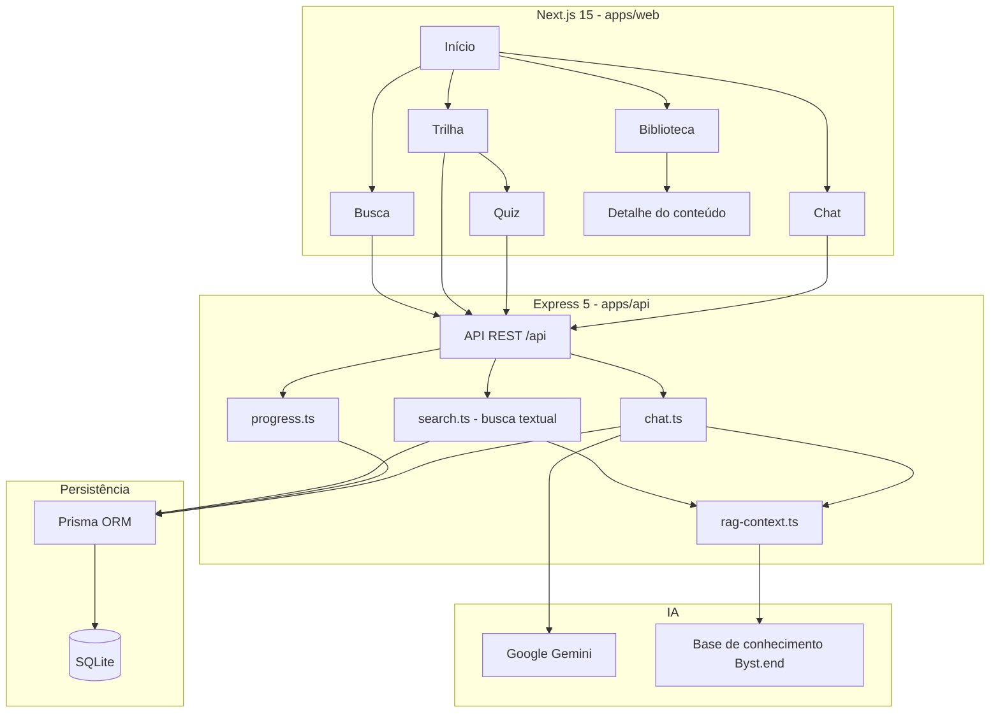

# Byst.end — Plataforma Educacional MVP

Plataforma digital para **prevenção de assédio e condutas inadequadas no trabalho**, transformando os materiais da Byst.end em uma experiência educativa, segura e interativa para colaboradores, lideranças e áreas de apoio.

---

## Objetivo da solução

Oferecer um ambiente onde o usuário possa **aprender**, **buscar orientação inicial** e **refletir sobre situações sensíveis** com linguagem acolhedora e responsável — sem substituir RH, jurídico, compliance ou canais oficiais de denúncia.

O MVP prioriza:

- Conteúdos organizados por **8 camadas metodológicas**
- **Busca inteligente** sobre a base educacional
- **Trilha** e **quiz** com progresso persistido
- **Chat orientativo** com RAG + Google Gemini, fontes citadas e disclaimers

---

## Metodologia Byst.end

A plataforma estrutura a jornada educacional em **8 Camadas de Aprendizagem**, do reconhecimento básico à prevenção contínua:

| # | Camada | Foco |
|---|--------|------|
| 1 | **Conhecimento Básico** | Fundamentos informativos sobre assédio e ambiente de trabalho saudável |
| 2 | **Diferenciação de Limites** | Educação sobre limites, respeito e comunicação profissional |
| 3 | **Reconhecimento de Condutas** | Identificação de comportamentos inadequados e microagressões |
| 4 | **Impacto e Consequências** | Consciência sobre efeitos na saúde, carreira e cultura organizacional |
| 5 | **Responsabilidades** | Papéis de liderança, RH, compliance e organização |
| 6 | **Orientação à Vítima** | Acolhimento, registro seguro e busca de apoio |
| 7 | **Papel das Testemunhas** | Ação coletiva e intervenção responsável |
| 8 | **Prevenção Contínua** | Cultura de respeito, revisão de práticas e aprendizado permanente |

Tom institucional, educativo e acolhedor em toda a experiência — **sem vereditos legais definitivos** nas interações com IA.

---

## Funcionalidades

| Módulo | Descrição |
|--------|-----------|
| **Biblioteca** | Vídeos, nano/microconteúdos, slogans e sazonais com filtros por tema, camada, tipo e risco |
| **Busca inteligente** | Busca textual ponderada com ranking e snippets (base preparada para embeddings) |
| **Trilha educativa** | Percursos por camadas; etapas marcáveis como concluídas com progresso restaurado |
| **Quiz** | Perguntas com feedback educativo; pontuação acumulada por sessão anônima |
| **Chat orientativo** | RAG sobre a base Byst.end + Gemini; fontes citadas, disclaimer e alerta em temas sensíveis |
| **API REST** | Backend Express documentado por rotas; validação Zod; Prisma + SQLite |

### Persistência de Sessão Anônima no banco SQLite usando Prisma

O navegador guarda **apenas** um identificador anônimo (`bystend_session` no `localStorage`, formato UUID ou `anon-{uuid}`). **Todo o progresso real** fica no servidor:

- Modelo `UserProgress` (Prisma): `quizScore`, `quizTotal`, `completedIds`, `completedLayers`
- `GET /api/progress/:sessionId` — restaura progresso ao abrir Quiz ou Trilha
- `POST /api/progress` — persiste conclusão de etapas da trilha
- `POST /api/quiz/answer` — incrementa pontuação do quiz na mesma sessão

Assim, o usuário retoma a jornada após recarregar a página, sem login nem cadastro.

---

## Jornada do usuário (visão geral)



---

## Novos Materiais e Base Legal

A base de conhecimento e o contexto do RAG incorporam referências que **enriquecem a conscientização** e o alinhamento com boas práticas organizacionais:

| Material | Papel na plataforma |
|----------|---------------------|
| **Convenção 190 da OIT** | Marco internacional sobre violência e assédio no mundo do trabalho; citado no contexto do chat quando relevante |
| **Nova NR-1** | Gestão de riscos ocupacionais e deveres da organização em ambiente seguro |
| **Think Eva** | Recortes de gênero e equidade para leitura sensível de situações |
| **Violentômetro** | Escala educativa da progressão de condutas (`data/violentometro.ts`) — apoio à identificação precoce |

Esses materiais **não substituem** parecer jurídico ou políticas internas; servem para **contextualizar** respostas educativas e materiais da biblioteca.

---

## Arquitetura

Monorepo **npm workspaces** na raiz:

```
bystend-platform/
├── apps/
│   ├── web/          # Next.js 15 (App Router), React 19, porta 3000
│   └── api/          # Express 5, porta 4000, prefixo /api
├── packages/
│   └── shared/       # Tipos e constantes compartilhados (Zod-friendly)
├── prisma/
│   └── schema.prisma # SQLite — Content, Layers, Quiz, UserProgress, Chat...
└── data/             # CSVs, violentometro.ts, materiais de seed
```

| Camada | Responsabilidade |
|--------|------------------|
| **apps/web** | UI, chamadas `fetch` à API, `getSessionId()` (só UUID no browser) |
| **apps/api** | Rotas REST, serviços (`chat`, `search`, `rag-context`, `progress`), seed |
| **packages/shared** | `ChatResponse`, `LAYER_DEFINITIONS`, `CHAT_DISCLAIMER`, tipos de conteúdo |
| **Prisma + SQLite** | Persistência única; `DATABASE_URL=file:./prisma/dev.db` (local) |

Fluxo típico: **Browser → Next.js → Express `/api/*` → Prisma → SQLite**. Em Docker, o SSR do Next usa `API_INTERNAL_URL` para falar com o container da API.

Documentação técnica detalhada: [`docs/architecture/`](docs/architecture/README.md).

---

## IA Responsável

O chat orientativo foi desenhado para uso **educativo e cauteloso**:

- **Não fornece parecer jurídico** nem conclusão definitiva de assédio
- **Não substitui** RH, jurídico, compliance, canal de denúncia ou apoio psicológico
- **Evita diagnósticos** e linguagem punitiva; prefere “pode conter sinais de conduta inadequada”
- **Contexto controlado via RAG**: recuperação textual na base Byst.end antes da geração (Gemini)
- **Disclaimer obrigatório** em toda resposta (`CHAT_DISCLAIMER` em `@bystend/shared`)
- **Fontes citadas** na UI (badges com link para `/conteudo/:id`)
- **Fallback empático** se `GEMINI_API_KEY` não estiver configurada ou o modelo falhar
- **Alerta de tema sensível** (`highRisk`) quando conteúdos de alto risco jurídico entram no contexto

---

## Stack tecnológica

| Área | Tecnologia |
|------|------------|
| Frontend | Next.js 15, React 19, TypeScript |
| Backend | Express 5, TypeScript (NodeNext + sufixo `.js` nos imports) |
| ORM / DB | Prisma 6, SQLite |
| IA | Google Gemini (`@google/generative-ai`) + RAG textual |
| Validação | Zod |
| Monorepo | npm workspaces |
| Deploy local | Docker Compose (API + Web + volume SQLite) |

---

## Como rodar

### Com Docker (recomendado para demo)

**Pré-requisitos:** Docker Compose v2, CSVs/materiais em `data/` ([`data/README.md`](data/README.md)).

```bash
cd bystend-platform
cp .env.docker.example .env
# Configure GEMINI_API_KEY para o chat com IA
docker compose --env-file .env up --build
```

| Serviço | URL |
|---------|-----|
| Web | http://localhost:3000 |
| API health | http://localhost:4000/api/health |

```bash
npm run docker:up      # docker compose up --build
npm run docker:down
npm run docker:logs
```

Seed automático na primeira subida com banco vazio (`SEED_IF_EMPTY=true`). `SEED_ON_START=true` força re-seed destrutivo.

### Localmente (desenvolvimento)

**Pré-requisitos:** Node.js 20+.

```bash
cd bystend-platform
cp .env.example .env
npm install
npm run db:push
npm run db:seed
npm run dev
```

- Web: http://localhost:3000  
- API: http://localhost:4000/api/health  

| Variável | Descrição |
|----------|-----------|
| `DATABASE_URL` | SQLite (`file:./prisma/dev.db`) |
| `CSV_DATA_DIR` | Pasta dos CSVs para seed |
| `API_PORT` | Porta da API (padrão 4000) |
| `NEXT_PUBLIC_API_URL` | URL da API para o browser |
| `GEMINI_API_KEY` | Chat com Gemini + RAG |
| `GEMINI_MODEL` | Modelo preferido (ex.: `gemini-2.5-flash`) |

---

## API principal (resumo)

| Método | Rota | Uso |
|--------|------|-----|
| GET | `/api/health` | Health check |
| GET | `/api/contents`, `/api/contents/:id` | Biblioteca |
| GET | `/api/search` | Busca textual |
| GET | `/api/learning-paths/:slug` | Trilha |
| GET | `/api/quiz` | Perguntas |
| POST | `/api/quiz/answer` | Avaliação + progresso do quiz |
| GET | `/api/progress/:sessionId` | Progresso da sessão anônima |
| POST | `/api/progress` | Marcar etapa/camada concluída |
| POST | `/api/chat` | Chat RAG + Gemini |

---

## Decisões técnicas

- **Seed estruturado** a partir de CSVs: camadas, sensibilidade, risco jurídico e `searchText`
- **RAG textual** no SQLite (sem embeddings no MVP) com limite de contexto para o prompt
- **Gemini** com fallback de modelos e resposta template se a API falhar
- **UserProgress** unificado para quiz e trilha (sem autenticação)
- **Tipos compartilhados** em `@bystend/shared` e `transpilePackages` no Next.js

---

## Limitações conhecidas (MVP)

- Busca **semântica por embeddings** ainda não implementada (ranking textual)
- Sem painel administrativo de conteúdos
- Sem autenticação corporativa (sessão 100% anônima por UUID)
- Chat depende de `GEMINI_API_KEY` para respostas generativas completas

---

## Próximos passos

- **Embeddings** e **busca vetorial** sobre a base educacional
- **Dashboard administrativo** para curadoria de conteúdos e trilhas
- **Autenticação corporativa** (SSO) mantendo trilhas por perfil
- **Analytics educacional** agregado e anônimo (engajamento por camada)
- **Gamificação segura** (badges, marcos) sem competição tóxica
- UI dedicada ao **Violentômetro** a partir de `data/violentometro.ts`
- Integração opcional **OpenAI** com os mesmos guardrails de RAG e fontes

---

## Roteiro de apresentação (5–7 min)

1. **Problema e proposta Byst.end** — educação preventiva com tom acolhedor (1 min)
2. **Demo:** Início → Biblioteca → Busca por situação (2 min)
3. **Trilha + Quiz** — progresso persistido no SQLite (1 min)
4. **Chat** — fontes, disclaimer e IA responsável (1 min)
5. **Arquitetura**, persistência anônima e roadmap (1 min)

---

## Licença e uso

Projeto desenvolvido no contexto do **hackathon Byst.end**. Uso educativo; não constitui aconselhamento jurídico ou psicológico.

Para agentes e contribuidores: skill **bystend-architecture-context** em `.cursor/skills/bystend-architecture-context/` e regras em `.cursor/rules/bystend.mdc`.
