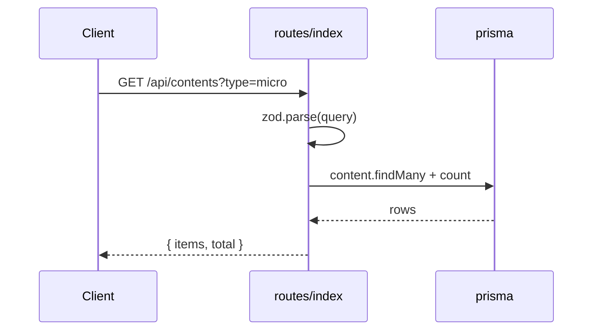
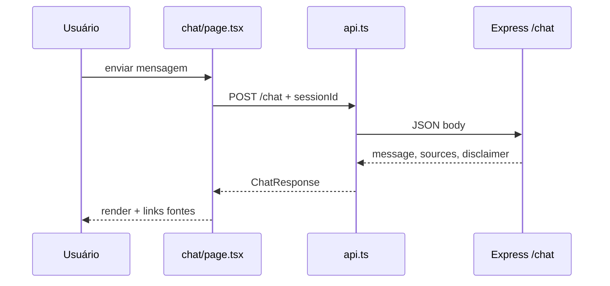

# Análise dos Apps

## Resumo

| App | Stack | Porta | Entrypoint |
|-----|-------|-------|------------|
| `@bystend/web` | Next.js 15, React 19 | 3000 | `next dev` / App Router |
| `@bystend/api` | Express 5, tsx/tsc | 4000 | `apps/api/src/index.ts` |

---

## `apps/api` — Backend REST

### Propósito

Expor API REST prefixada em `/api` para conteúdos, busca, trilhas, quiz e chat; executar seed a partir de CSVs; persistir em SQLite via Prisma.

### Estrutura

```
apps/api/src/
├── index.ts              # Bootstrap Express
├── routes/
│   └── index.ts          # Todas as rotas + error handler
├── services/
│   ├── search.ts         # Busca textual ponderada
│   ├── chat.ts           # Orquestração Gemini + persistência
│   └── rag-context.ts    # Montagem de contexto RAG
├── lib/
│   ├── prisma.ts         # Singleton PrismaClient
│   └── normalize.ts      # Slugify, risco, violência, searchText
└── seed/
    ├── index.ts          # Orquestrador wipe + seed
    ├── csv.ts            # Leitura CSV + nomes de arquivos
    ├── layers.ts         # Camadas + categorias
    ├── videos.ts
    ├── nano-contents.ts
    ├── seasonal.ts
    ├── slogans.ts
    ├── learning-paths.ts
    └── quiz.ts
```

### Entrypoint (`index.ts`)

1. Carrega `dotenv` (duplo: `import "dotenv/config"` + `config({ path: .env })`)
2. `cors({ origin: true })` — qualquer origem
3. `express.json()`
4. Monta `app.use("/api", router)`
5. Listen em `API_PORT` (default 4000)

### Rotas (`routes/index.ts`)

| Método | Path | Handler | Validação |
|--------|------|---------|-----------|
| GET | `/health` | Health check | — |
| GET | `/categories` | Lista categorias + count | — |
| GET | `/layers` | 8 camadas educacionais | — |
| GET | `/contents` | Lista paginada/filtrada | Zod query |
| GET | `/contents/:id` | Detalhe | — |
| GET | `/search` | Busca | Zod → `searchContents` |
| GET | `/seasonal` | Sazonais por mês | query `month` |
| GET | `/learning-paths` | Lista trilhas | — |
| GET | `/learning-paths/:slug` | Trilha com itens | — |
| GET | `/quiz` | Perguntas (options parseados) | — |
| POST | `/quiz/answer` | Avalia + opcional `UserProgress` | Zod body |
| POST | `/chat` | Chat RAG+Gemini | Zod body |

**Error handler global:** `ZodError` → 400; demais → 500 `{ error }`.

### Serviços

#### `search.ts`

- Tokeniza query (remove emojis, min length 3)
- `findMany` até **200** contents com filtros opcionais
- Score por substring em title/summary/theme/searchText/violenceType/body
- Ordena e retorna top `limit`

#### `rag-context.ts`

- Chama `searchContents` → para cada hit, `findUnique` com nanoCards
- Monta blocos de texto estruturados
- Limita contexto a `MAX_CONTEXT_CHARS = 12000`

#### `chat.ts`

- `retrieveContextForQuery` + `formatContextForPrompt`
- Tenta `generateWithGemini` (modelos: `GEMINI_MODEL`, `gemini-1.5-flash`, `gemini-2.5-flash`)
- Fallback: `buildFallbackReply` (template empático + títulos)
- Persiste `ChatSession` / `ChatMessage`
- Retorna `ChatResponse` (shared type)

### Middlewares

**Não há** middleware de auth, rate limit ou logging estruturado. Apenas:

- CORS
- `express.json()`
- Error handler no final do router

### Integrações

- **Google Gemini** via `GEMINI_API_KEY`
- **CSVs** via filesystem (`CSV_DATA_DIR`)
- **Prisma/SQLite**

### Variáveis de ambiente (API)

| Variável | Uso |
|----------|-----|
| `DATABASE_URL` | Prisma |
| `API_PORT` | Porta HTTP |
| `CSV_DATA_DIR` | Seed |
| `GEMINI_API_KEY` | Chat |
| `GEMINI_MODEL` | Modelo preferido |
| `OPENAI_API_KEY` | Não usado no código atual |
| `NODE_ENV` | Log level Prisma |

### Dependências

- **Interna:** `@bystend/shared`
- **Externas:** express, cors, zod, dotenv, csv-parse, @google/generative-ai, @prisma/client

### Fluxo típico (GET conteúdo)



---

## `apps/web` — Frontend Next.js

### Propósito

Interface educativa: navegação, biblioteca, busca, trilha, quiz, chat, detalhe de conteúdo.

### Estrutura

```
apps/web/src/
├── app/                    # App Router
│   ├── layout.tsx          # Nav + container
│   ├── page.tsx            # Home (SSR)
│   ├── globals.css
│   ├── biblioteca/page.tsx
│   ├── busca/page.tsx      # "use client"
│   ├── chat/page.tsx       # "use client"
│   ├── quiz/page.tsx       # "use client"
│   ├── trilha/page.tsx     # SSR
│   └── conteudo/[id]/page.tsx
├── components/
│   ├── Nav.tsx
│   ├── ContentCard.tsx
│   └── Disclaimer.tsx
└── lib/
    └── api.ts              # fetch wrapper + sessionId
```

### Rotas Next.js (UI)

| Rota | Render | Dados |
|------|--------|-------|
| `/` | Server | seasonal + featured micro |
| `/biblioteca` | Server | contents + categories (searchParams) |
| `/busca` | Client | POST search via GET `/search` |
| `/trilha` | Server | `/learning-paths/reconhecer-e-agir` |
| `/quiz` | Client | GET `/quiz`, POST `/quiz/answer` |
| `/chat` | Client | POST `/chat` |
| `/conteudo/[id]` | Server | GET `/contents/:id` |

### Client API (`lib/api.ts`)

```typescript
const API_URL = process.env.NEXT_PUBLIC_API_URL ?? "http://localhost:4000";
// fetch(`${API_URL}/api${path}`)
```

- `cache: "no-store"` em todas as requests
- `getSessionId()`: `localStorage` key `bystend_session`, UUID anônimo

### Componentes

| Componente | Responsabilidade |
|------------|------------------|
| `Nav` | Links + highlight pathname (client) |
| `ContentCard` | Card link para `/conteudo/[id]` |
| `Disclaimer` | Aviso legal/educativo estático |

### Providers / middleware Next

- **Sem** `middleware.ts`
- **Sem** React Context global
- `next.config.ts`: `transpilePackages: ["@bystend/shared"]` apenas

### Variáveis de ambiente (Web)

| Variável | Uso |
|----------|-----|
| `NEXT_PUBLIC_API_URL` | Base da API (sem `/api` — adicionado no client) |

### Dependências

- **Interna:** `@bystend/shared` (transpilado; uso limitado no web atual)
- **Externas:** next, react, react-dom

### Fluxo página Chat



### Padrão SSR resiliente

Páginas server (`page.tsx`, `biblioteca`, `trilha`, `home`) envolvem `api()` em `try/catch` vazio para **build sem API** — listas vazias, sem crash.

### Limitações de UI documentadas no código

- Trilha: `completed = 0` hardcoded — progresso **demonstrativo**
- Quiz score local + opcional persistência API
- Chat: histórico só em state React (não recarrega mensagens do DB na UI)

---

## Comunicação entre apps

```
Browser → Next (3000) → fetch → Express (4000/api/*) → Prisma → SQLite
```

Não há BFF: o browser (via client components) ou o servidor Next falam diretamente com a API.
