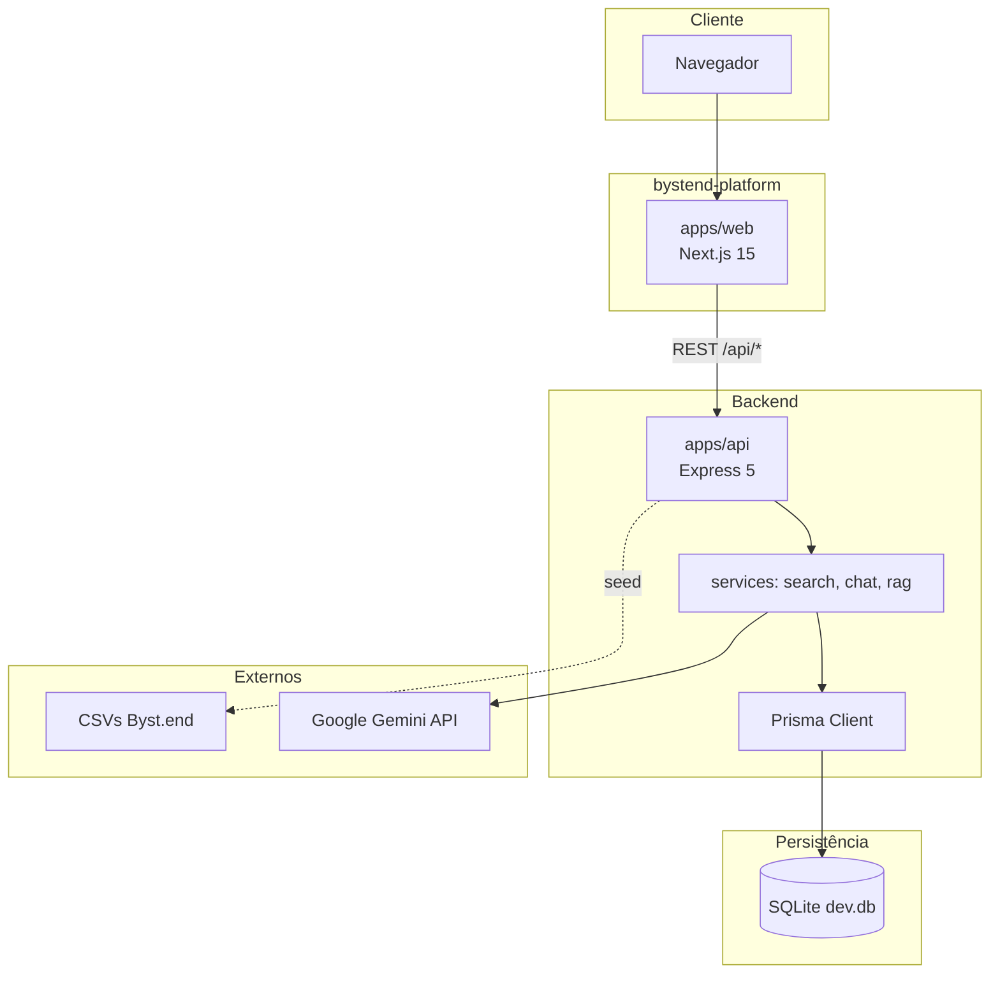

# Visão Geral da Arquitetura

## O que o sistema faz

A **Byst.end Platform** é um MVP de plataforma educacional digital que transforma materiais da Byst.end (CSVs com vídeos, nano/microconteúdos, camadas metodológicas, conteúdos sazonais e slogans) em uma experiência web com:

- Biblioteca filtrável de conteúdos
- Busca textual ponderada
- Trilha educativa pelas 8 camadas
- Quiz com feedback não conclusivo
- Chat orientativo com RAG textual + Google Gemini (com fallback local)

O sistema **não substitui** RH, jurídico ou canais de denúncia; guardrails de linguagem e disclaimers são parte do design.

## Diagrama de contexto



## Domínios principais

| Domínio | Responsabilidade | Onde vive |
|---------|------------------|-----------|
| **Conteúdo educacional** | CRUD leitura, filtros, detalhe | API routes + Prisma `Content` |
| **Taxonomia** | Categorias, camadas, tipos de violência | `Category`, `EducationLayer`, campos em `Content` |
| **Descoberta** | Busca e ranking textual | `apps/api/src/services/search.ts` |
| **Aprendizagem guiada** | Trilhas, quiz | `LearningPath`, `QuizQuestion`, páginas `/trilha`, `/quiz` |
| **Orientação por IA** | RAG + Gemini + fallback | `chat.ts`, `rag-context.ts` |
| **Sessão anônima** | Progresso quiz/chat sem login | `localStorage`, `UserProgress`, `ChatSession` |

## Camadas arquiteturais

```mermaid
flowchart LR
  subgraph presentation [Apresentação]
    Pages[Next.js App Router pages]
    Components[React components]
  end

  subgraph api_layer [API]
    Routes[routes/index.ts]
    Services[services/*]
    Lib[lib/prisma, normalize]
  end

  subgraph shared [Compartilhado]
    Types["@bystend/shared types"]
  end

  subgraph persistence [Persistência]
    Schema[prisma/schema.prisma]
    DB[(SQLite)]
  end

  Pages -->|fetch api()| Routes
  Routes --> Services
  Services --> Lib
  Services --> Types
  Lib --> Schema
  Schema --> DB
```

## Princípios explícitos (`.cursor/rules/bystend.mdc`)

1. **Separação:** UI em `apps/web`, REST em `apps/api`, tipos em `packages/shared`
2. **API:** prefixo `/api`, validação Zod, erros `{ error, details? }`
3. **Sem regra de negócio pesada no React** — apenas estado de UI
4. **Conteúdo sensível:** linguagem educativa, sem diagnóstico jurídico definitivo
5. **Chat:** citar fontes, disclaimer, cautela em `legalRisk` alto

## Stack resumida

| Camada | Tecnologia |
|--------|------------|
| Frontend | Next.js 15, React 19, App Router, CSS modules globais |
| Backend | Express 5, tsx (dev), tsc (build) |
| ORM | Prisma 6 + SQLite |
| Validação | Zod 3 |
| IA | `@google/generative-ai` (Gemini) |
| Monorepo | npm workspaces |
| Linguagem | TypeScript strict |

## Entrypoints

| App | Comando | Entry |
|-----|---------|-------|
| Monorepo | `npm run dev` | `concurrently` api + web |
| API | `npm run dev -w @bystend/api` | `apps/api/src/index.ts` |
| Web | `npm run dev -w @bystend/web` | Next.js (`apps/web`) |
| Seed | `npm run db:seed` | `apps/api/src/seed/index.ts` |
| Prisma | `npm run db:push` | `prisma/schema.prisma` (raiz) |

## O que o sistema **não** tem (MVP)

- Autenticação JWT/OAuth
- Painel admin
- Filas, workers, cron
- Cache Redis
- Migrations versionadas (usa `db push`)
- Embeddings / busca vetorial
- Testes automatizados no repositório

## Trade-offs da arquitetura atual

| Decisão | Vantagem | Custo |
|---------|----------|-------|
| Monorepo npm workspaces | Simplicidade, tipos compartilhados | Build ordenado manual (`shared` primeiro) |
| API separada do Next | Atende requisito REST explícito | CORS, duplo deploy, `NEXT_PUBLIC_API_URL` |
| SQLite | Zero infra local, demo rápida | Escala e concorrência limitadas |
| RAG textual | Sem infra de vetores | Recall inferior a embeddings |
| Sessão anônima | Privacidade aparente, UX simples | Sem identidade real, progresso frágil |

## Referências no repositório

- README do produto: `/README.md`
- Regras Cursor: `/.cursor/rules/bystend.mdc`
- Plano MVP original: `/.cursor/plano_byst.end_mvp_1339670d.plan.md`
