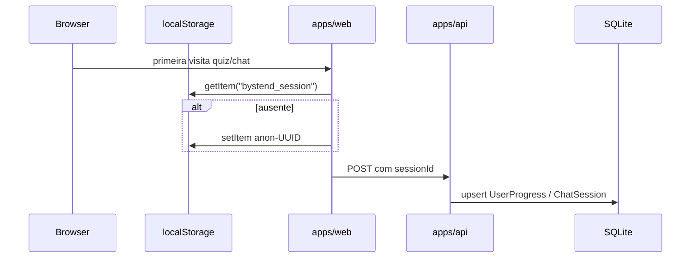
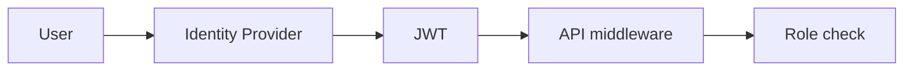

# Fluxo de Autenticação e Sessão

## Estado atual: sem autenticação tradicional

O MVP **não implementa**:

- Login / logout
- JWT, cookies de sessão HTTP-only
- OAuth, SSO corporativo
- RBAC ou ABAC
- Middleware de autorização na API

Todas as rotas REST são **públicas** (CORS aberto `origin: true`).

## Modelo: sessão anônima cliente



### Implementação web (`apps/web/src/lib/api.ts`)

```typescript
const key = "bystend_session";
id = `anon-${crypto.randomUUID()}`;
localStorage.setItem(key, id);
```

- SSR: retorna `"server"` (não persiste)
- Quiz e Chat usam `getSessionId()` apenas no client

### Implementação API

| Endpoint | Uso de sessionId |
|----------|------------------|
| `POST /quiz/answer` | Opcional; se presente, `userProgress.upsert` |
| `POST /chat` | Default `anon-${Date.now()}` se omitido; cria `ChatSession` |

**Inconsistência:** chat sem sessionId do client gera ID novo a cada request se o body não enviar — o web **sempre** envia do localStorage.

## Persistência server-side

### `UserProgress`

- Chave: `sessionId` (string única)
- Atualiza `quizScore` / `quizTotal` incrementalmente
- **Não lido** por nenhum endpoint GET exposto

### `ChatSession` + `ChatMessage`

- `ChatSession.sessionId` = string do cliente (não confundir com `ChatSession.id` cuid interno)
- Mensagens armazenadas com `role` user|assistant
- `sources` JSON no assistant message
- **Sem endpoint** para recuperar histórico na UI

## Autorização

Inexistente. Qualquer cliente que conheça a URL da API pode:

- Listar todo conteúdo
- Enviar mensagens de chat (consumindo quota Gemini)
- Responder quiz infinitamente

## Implicações de segurança

| Aspecto | Risco |
|---------|-------|
| API pública | Abuso de chat (custo LLM) |
| sessionId previsível | Baixo — UUID v4 |
| Sem rate limit | DoS leve / spam |
| Dados em SQLite | Acesso ao arquivo = vazamento de relatos |

## Guardrails (não são auth)

Proteções de **conteúdo**, não de identidade:

- `legalRisk` alto → flag `highRisk` na resposta
- System prompt Gemini + fallback template
- `CHAT_DISCLAIMER` obrigatório
- Validação Zod tamanho mensagem (max 4000)

## README vs código — chat LLM

README "Limitações" diz: *"Chat não usa LLM externo por padrão"*.

**Código atual:** tenta Gemini primeiro; fallback só em erro. Com `GEMINI_API_KEY` setada, **usa LLM**. Documentar como inconsistência de README.

## Evolução esperada (hipótese)

Plano MVP menciona "modo anônimo reforçado" — possível:

- Cookies httpOnly para sessionId
- Rate limiting por IP/session
- Opt-in para persistir progresso
- Auth corporativa para admin (futuro)

## Diagrama conceitual futuro (não implementado)



Hoje: `User --> localStorage --> API (sem gate)`.
