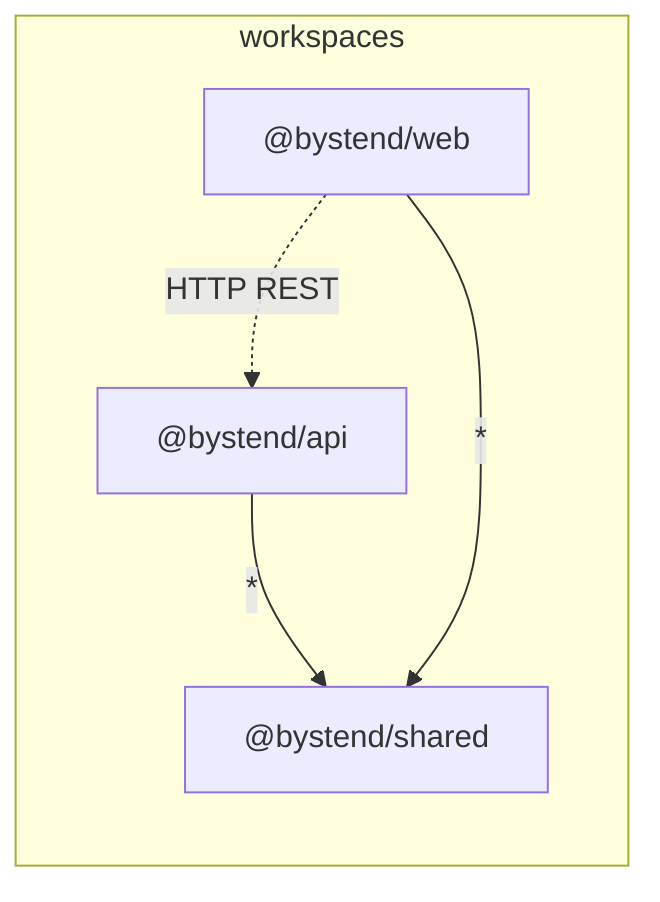
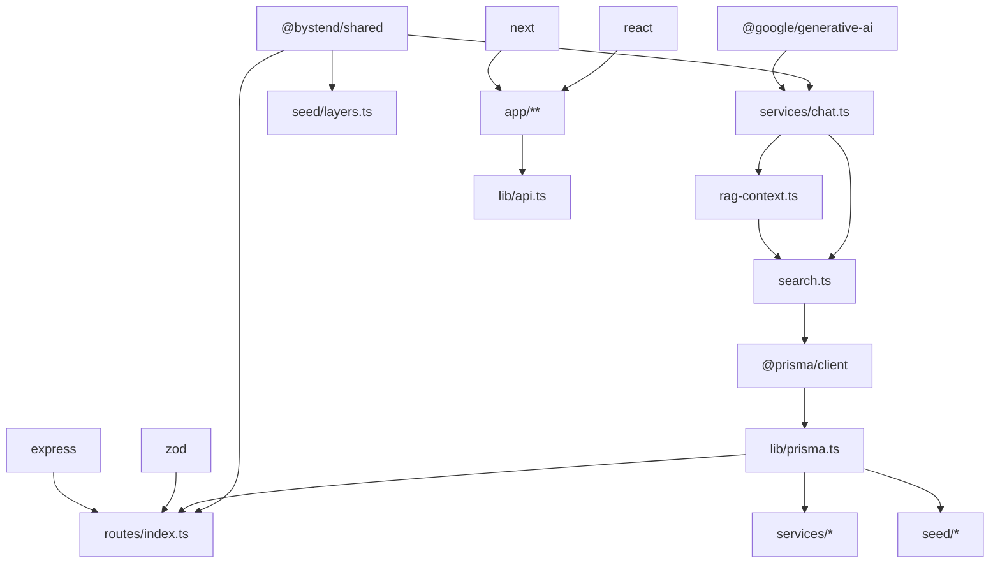

# Grafo de Dependências

## Dependências internas



## Dependências da raiz (`package.json`)

| Pacote | Tipo | Função arquitetural |
|--------|------|---------------------|
| `@prisma/client` | dependency | ORM runtime (usado pela API) |
| `prisma` | devDependency | CLI generate/push |
| `typescript` | devDependency | Compilação monorepo |
| `concurrently` | devDependency | Dev paralelo api+web |

## `apps/api` — dependências críticas

| Pacote | Versão | Impacto |
|--------|--------|---------|
| `express` | ^5.1.0 | Servidor HTTP, routing |
| `@prisma/client` | ^6.8.2 | Todo acesso a dados |
| `zod` | ^3.24.4 | Validação de entrada |
| `@google/generative-ai` | ^0.24.1 | Chat LLM |
| `csv-parse` | ^5.6.0 | Importação seed |
| `cors` | ^2.8.5 | Cross-origin para Next |
| `dotenv` | ^16.5.0 | Config local |
| `tsx` | dev | Hot reload TS |

## `apps/web` — dependências críticas

| Pacote | Versão | Impacto |
|--------|--------|---------|
| `next` | ^15.3.2 | Framework, SSR, routing |
| `react` / `react-dom` | ^19.1.0 | UI |

## `packages/shared`

| Pacote | Impacto |
|--------|---------|
| `typescript` | Build de declarações |

## Mapa de uso por módulo



## Providers externos

| Provider | Protocolo | Obrigatório? |
|----------|-----------|--------------|
| Google Gemini | HTTPS API | Não — fallback local no chat |
| CSV filesystem | Local FS | Sim para seed completo |
| SQLite file | File I/O | Sim |

## `OPENAI_API_KEY`

Presente em `.env.example` e README como **reservado** — **nenhum import** no código atual.

## Cadeia de build

```
npm install
  └─ postinstall: prisma generate

npm run build
  ├─ @bystend/shared: tsc → dist/
  ├─ @bystend/api: tsc → dist/ (imports .js)
  └─ @bystend/web: next build
```

## Matriz de acoplamento a bibliotecas

| Se remover... | Efeito |
|---------------|--------|
| Prisma | API e seed quebram totalmente |
| Gemini | Chat usa fallback template |
| Zod | Rotas perdem validação tipada |
| csv-parse | Seed retorna vazio (warn) |
| shared | API precisa redefinir tipos/disclaimer |
| Next | Sem frontend |

## Versões Node

README exige **Node.js 20+**. Workspaces npm nativos (sem pnpm/yarn).
