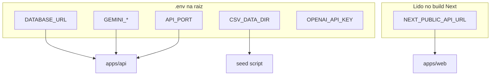

# Análise de Variáveis de Ambiente

## Arquivos

| Arquivo | Versionado | Uso |
|---------|------------|-----|
| `.env.example` | Sim | Template |
| `.env` | Não (gitignore) | Runtime local |

## Variáveis documentadas

### `.env.example` (fonte versionada)

```env
DATABASE_URL="file:./dev.db"
CSV_DATA_DIR="../../data"
OPENAI_API_KEY=""
GEMINI_API_KEY=""
GEMINI_MODEL="gemini-2.5-flash"
API_PORT=4000
NEXT_PUBLIC_API_URL="http://localhost:4000"
```

### Tabela completa

| Variável | Consumidor | Obrigatória | Default implícito | Descrição |
|----------|------------|-------------|-------------------|-----------|
| `DATABASE_URL` | Prisma | Sim | — | Connection string SQLite |
| `CSV_DATA_DIR` | seed | Não* | heurísticas em `resolveDataDir` | Pasta dos CSVs |
| `API_PORT` | `apps/api/src/index.ts` | Não | `4000` | Porta HTTP da API |
| `GEMINI_API_KEY` | `chat.ts` | Não** | — | Chave Google AI |
| `GEMINI_MODEL` | `chat.ts` | Não | tenta 1.5-flash, 2.5-flash | Modelo preferido |
| `OPENAI_API_KEY` | — | Não | não usado | Reservado |
| `NEXT_PUBLIC_API_URL` | `apps/web/src/lib/api.ts` | Não | `http://localhost:4000` | Base URL API (sem `/api`) |
| `NODE_ENV` | `lib/prisma.ts` | Não | — | Logs Prisma + singleton |

\* Obrigatória para seed com dados reais fora dos paths padrão.  
\** Obrigatória apenas se quiser respostas Gemini; sem ela, fallback local.

## Carregamento de env na API

Dupla carga em `index.ts`:

1. `import "dotenv/config"` (topo)
2. `config({ path: path.resolve(process.cwd(), ".env") })`

**Hipótese:** garantir `.env` na raiz quando cwd varia; redundante na maioria dos casos.

**Cwd esperado:** raiz do monorepo ao rodar `npm run dev` (workspaces).

## Variáveis Next.js

Apenas `NEXT_PUBLIC_*` expostas ao browser:

- `NEXT_PUBLIC_API_URL` — visível no bundle client

**Nunca** colocar `GEMINI_API_KEY` no web.

## Inconsistências documentais

| Fonte | `DATABASE_URL` |
|-------|----------------|
| `.env.example` | `file:./dev.db` (raiz) |
| README.md | `file:./prisma/dev.db` |

Verificar qual path o Prisma efetivamente cria no ambiente local. Com cwd na raiz, `./dev.db` é na raiz.

## `.gitignore` relacionado

```
.env
.env.local
*.db
*.db-journal
```

## Matriz por app



## Checklist setup novo dev

1. `cp .env.example .env`
2. Preencher `GEMINI_API_KEY` se testar chat LLM
3. Ajustar `CSV_DATA_DIR` para pasta com CSVs Byst.end
4. `npm install` → `db:push` → `db:seed`
5. Confirmar `NEXT_PUBLIC_API_URL` aponta para API rodando

## Docker Compose

Template: [`.env.docker.example`](../../.env.docker.example). Orquestração: [`docker-compose.yml`](../../docker-compose.yml).

| Variável | Serviço | Descrição |
|----------|---------|-----------|
| `DATABASE_URL` | api | Fixo no compose: `file:/app/data/dev.db` (volume `bystend-db`) |
| `CSV_DATA_DIR` | api | Fixo: `/app/data/csvs` (bind `CSV_HOST_PATH` → host `./data`) |
| `SEED_ON_START` | api | `true` executa `node apps/api/dist/seed/index.js` no entrypoint |
| `NEXT_PUBLIC_API_URL` | web (build) | **Build arg** — URL acessível pelo browser (ex.: `http://localhost:4000`) |
| `API_PORT` / `WEB_PORT` | compose | Mapeamento de portas no host |

**Importante:** `NEXT_PUBLIC_API_URL` é embutida no bundle do Next no **build** da imagem `web`. Se mudar a URL pública da API, reconstrua: `docker compose build web`.

## Produção (hipótese)

Não há `.env.production` no repo. Seria necessário:

- `DATABASE_URL` para Postgres gerenciado
- Secrets manager para `GEMINI_API_KEY`
- `NEXT_PUBLIC_API_URL` URL pública da API
