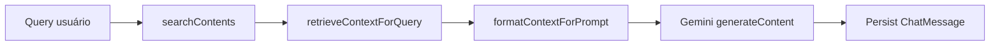

# Integrações Externas

## Google Gemini (ativa)

### Pacote

`@google/generative-ai` em `apps/api/src/services/chat.ts`

### Configuração

| Env | Função |
|-----|--------|
| `GEMINI_API_KEY` | Obrigatória para LLM (senão fallback) |
| `GEMINI_MODEL` | Primeiro candidato (default exemplo: `gemini-2.5-flash`) |

### Modelos tentados (ordem)

1. `process.env.GEMINI_MODEL`
2. `gemini-1.5-flash`
3. `gemini-2.5-flash`

Loop com retry no próximo modelo se falhar.

### Contrato

- **System instruction:** regras empáticas Byst.end (não afirmar assédio categoricamente)
- **User prompt:** bloco RAG + pergunta do usuário
- **Output:** texto PT-BR, máx ~4 parágrafos (instruído no prompt)

### Fluxo RAG

### Fallback

Se Gemini falha ou sem API key:

- Template `buildFallbackReply` com tom empático
- Usa top 3 resultados de busca
- Heurística extra se mensagem menciona "gestor"/"líder"
- `highRisk` reforça canais oficiais

### Guardrails implementados

| Guardrail | Onde |
|-----------|------|
| Contexto exclusivo da base | SYSTEM_PROMPT + RAG block |
| Disclaimer fixo | `CHAT_DISCLAIMER` em toda resposta |
| highRisk flag | `isHighLegalRisk()` em chunks/search |
| Max context 12k chars | `rag-context.ts` |
| Max message 4000 | Zod em route |

### Não implementado

- Citações estruturadas forçadas no JSON
- Moderação de entrada (OpenAI Moderation, etc.)
- Logging de prompts para auditoria
- Streaming SSE para o cliente

---

## OpenAI (reservada)

- `OPENAI_API_KEY` em `.env.example`
- **Zero referências** no código
- README lista como uso futuro

---

## CSVs Byst.end (seed)

### Arquivos esperados (`apps/api/src/seed/csv.ts`)

| Chave | Nome do arquivo |
|-------|-----------------|
| videos | `VÍDEOS, NANO E MICRO CONTEÚDOS EDUCATIVOS.xlsx - 1. VÍDEOS (PALESTRAS, WEBINARES.csv` |
| nano | `... - 2.3. NANO CONTEÚDOS.csv` |
| layers | `... - 2.2. CAMADAS E TEMAS.csv` |
| seasonal | `... - 2.4. CONTEÚDOS SAZONAIS.csv` |
| slogans | `... - 2.5 SLOGANS.csv` |

### Resolução de diretório (`resolveDataDir`)

1. `CSV_DATA_DIR` absoluto
2. `CSV_DATA_DIR` relativo ao cwd
3. `data/`, `../../data/`
4. Fallback hardcoded `C:\Users\lrzezak\Downloads` (dev específico)
5. Marker file: presença do CSV nano

### Parser

- `csv-parse/sync` com `columns: true`, `relax_column_count: true`, BOM

### Normalização (`lib/normalize.ts`)

- Tipos de violência padronizados
- Camada via regex `CAMADA (\d+)`
- `searchText` denormalizado
- Emojis removidos para busca

---

## URLs externas de conteúdo

Vídeos e mídias: campo `Content.url` aponta para links externos (YouTube, etc.) — **não há** proxy ou validação de URL.

---

## Next.js ↔ Express

Integração **HTTP REST**, não GraphQL nem tRPC.

| Variável | Default |
|----------|---------|
| `NEXT_PUBLIC_API_URL` | `http://localhost:4000` |

Paths sempre prefixados `/api` no client helper.

---

## Embeddings / busca semântica

**Não integrado.** README e plano listam como próximo passo. Arquitetura atual prepara `searchText` para FTS ou vetores futuros.

---

## Tabela resumo

| Integração | Status | Criticidade MVP |
|------------|--------|-----------------|
| Gemini | Ativa com fallback | Média (demo chat) |
| CSV seed | Necessária para dados reais | Alta (primeiro setup) |
| OpenAI | Placeholder | Nenhuma |
| SSO/IdP | Ausente | N/A |
