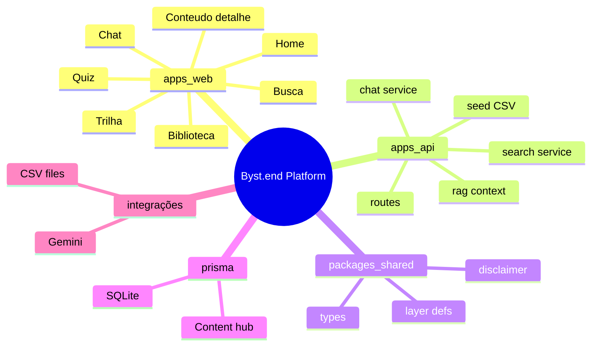

# Contexto para LLMs — Byst.end Platform

> **Arquivo prioritário.** Leia isto antes de modificar qualquer código neste repositório.

---

## 1. Resumo executivo

### O que o sistema faz

**Byst.end Platform** é um MVP de plataforma educacional sobre **prevenção de assédio no trabalho**. Importa materiais da Byst.end (CSVs) para SQLite e oferece:

- Biblioteca de conteúdos (vídeo, nano, micro, sazonal)
- Busca textual ponderada
- Trilha pelas 8 camadas metodológicas
- Quiz com feedback educativo (sem veredito legal definitivo)
- Chat orientativo com **RAG textual + Google Gemini** (fallback template se LLM falhar)

**Não é:** canal de denúncia, consultoria jurídica, RH, nem sistema autenticado corporativo.

### Arquitetura geral

```
npm monorepo
├── apps/web     → Next.js 15 (porta 3000)
├── apps/api     → Express 5 REST /api (porta 4000)
├── packages/shared → tipos + CHAT_DISCLAIMER + LAYER_DEFINITIONS
└── prisma/      → SQLite schema (raiz)
```

Comunicação: **HTTP JSON** (`NEXT_PUBLIC_API_URL` + `/api/...`). Sem GraphQL, sem filas.

### Principais domínios

| Domínio | Local |
|---------|-------|
| Conteúdo | `Content` + seed CSV |
| Taxonomia | `Category`, `EducationLayer` |
| Descoberta | `services/search.ts` |
| Aprendizagem | `LearningPath`, `QuizQuestion`, páginas `/trilha`, `/quiz` |
| IA orientativa | `services/chat.ts`, `rag-context.ts` |
| Sessão anônima | `localStorage` + `UserProgress` / `ChatSession` |

---

## 2. Mapa mental do sistema



### Fluxos principais

| Fluxo | Caminho |
|-------|---------|
| Listar conteúdos | Web SSR → `GET /api/contents` → Prisma |
| Buscar | Web client → `GET /api/search` → search service |
| Chat | Web client → `POST /api/chat` → RAG → Gemini → DB |
| Quiz | Web client → `GET/POST /api/quiz*` |
| Seed | CLI → `apps/api/src/seed/index.ts` → CSV → Prisma wipe+insert |

---

## 3. Onde está cada coisa

| Preocupação | Onde procurar |
|-------------|---------------|
| **Regras de negócio (conteúdo sensível)** | `.cursor/rules/bystend.mdc`, prompts em `chat.ts` |
| **Autenticação** | **Não existe** — só `getSessionId()` em `apps/web/src/lib/api.ts` |
| **Infra HTTP** | `apps/api/src/index.ts` |
| **Rotas REST** | `apps/api/src/routes/index.ts` |
| **Banco / ORM** | `prisma/schema.prisma`, `apps/api/src/lib/prisma.ts` |
| **APIs públicas** | Todas em `/api/*` (ver tabela abaixo) |
| **Normalização CSV** | `apps/api/src/lib/normalize.ts` |
| **Importação dados** | `apps/api/src/seed/*.ts` |
| **UI páginas** | `apps/web/src/app/**/page.tsx` |
| **Componentes UI** | `apps/web/src/components/` |
| **Cliente HTTP web** | `apps/web/src/lib/api.ts` |
| **Tipos compartilhados** | `packages/shared/src/index.ts` |
| **Env** | `.env.example` (raiz) |
| **Scripts monorepo** | `package.json` raiz |

### Endpoints REST (memorizar)

| Método | Path |
|--------|------|
| GET | `/api/health` |
| GET | `/api/categories` |
| GET | `/api/layers` |
| GET | `/api/contents` |
| GET | `/api/contents/:id` |
| GET | `/api/search?q=` |
| GET | `/api/seasonal` |
| GET | `/api/learning-paths` |
| GET | `/api/learning-paths/:slug` |
| GET | `/api/quiz` |
| POST | `/api/quiz/answer` |
| POST | `/api/chat` |

---

## 4. Como adicionar features

### Nova rota API

1. Adicionar handler em `apps/api/src/routes/index.ts` (ou extrair sub-router se grande)
2. Validar com **Zod** (`schema.parse`)
3. Lógica em `apps/api/src/services/` se não for trivial CRUD
4. Usar `prisma` via `lib/prisma.ts`
5. Retornar erros `{ error, details? }`
6. Atualizar tipos em `packages/shared` se o contrato for usado pelo web
7. Documentar no `README.md` (regra do projeto)

### Nova página web

1. Criar `apps/web/src/app/<rota>/page.tsx`
2. Server Component por padrão; `"use client"` só se precisar state/events
3. Chamar `api<T>("/path")` de `@/lib/api`
4. Incluir `<Disclaimer />` se conteúdo sensível
5. Adicionar link em `components/Nav.tsx`
6. **Não** colocar regra de negócio de assédio/IA no componente — manter na API

### Novo campo no banco

1. Editar `prisma/schema.prisma`
2. `npm run db:push` (raiz)
3. Atualizar seed se vem de CSV
4. Atualizar rotas/services que serializam `Content`

### Novo tipo de conteúdo

1. Adicionar ao union `ContentType` em `packages/shared`
2. Tratar no seed e filtros da biblioteca
3. Considerar `searchText` no seed

### Convenções obrigatórias

- Tom acolhedor; nunca "isso é assédio" categórico
- Chat: fontes + `CHAT_DISCLAIMER`
- TypeScript strict, evitar `any`
- API imports: sufixo `.js` (NodeNext)
- Web imports: alias `@/`

---

## 5. Fluxos críticos

### Autenticação (ausente)

```
localStorage["bystend_session"] = "anon-" + UUID
→ enviado em POST /quiz/answer e POST /chat
→ API persiste UserProgress / ChatSession
```

Não implementar JWT sem requisito explícito do usuário.

### Request flow (chat) — o mais complexo

```
POST /api/chat { message, sessionId }
  → retrieveContextForQuery (search + findUnique chunks)
  → formatContextForPrompt
  → generateWithGemini (ou buildFallbackReply)
  → prisma chatSession + chatMessage ×2
  → { message, sources, disclaimer, highRisk }
```

### Persistência

- Leitura: Prisma `findMany` / `findUnique`
- Escrita MVP: seed (wipe), quiz progress, chat messages
- **Sem** transações explícitas multi-step

### Comunicação interna

- Web ↔ API: REST JSON only
- API ↔ shared: import npm workspace
- API modules: `search` ← `rag-context` ← `chat`; `routes` → all

---

## 6. Arquivos críticos

| Arquivo | Por que importa |
|---------|-----------------|
| `prisma/schema.prisma` | Modelo de dados único; mudança afeta tudo |
| `apps/api/src/routes/index.ts` | Superfície REST completa |
| `apps/api/src/services/chat.ts` | IA, guardrails, persistência chat |
| `apps/api/src/services/search.ts` | Busca + base do RAG |
| `apps/api/src/services/rag-context.ts` | Montagem prompt context |
| `apps/api/src/seed/index.ts` | Orquestração dados; destrutivo |
| `apps/api/src/seed/csv.ts` | Nomes fixos dos CSVs |
| `apps/api/src/lib/normalize.ts` | Violência, risco, searchText |
| `packages/shared/src/index.ts` | Contratos cross-app |
| `apps/web/src/lib/api.ts` | URL API + sessionId |
| `.cursor/rules/bystend.mdc` | Regras obrigatórias tom/IA |
| `package.json` (raiz) | Workspaces e scripts db |
| `.env.example` | Variáveis necessárias |

---

## 7. Riscos arquiteturais (não ignorar)

| Risco | Ação da LLM |
|-------|-------------|
| API pública | Não expor secrets; considerar rate limit se tocar chat |
| README vs código (LLM) | Com `GEMINI_API_KEY`, chat **usa** Gemini |
| Seed destrutivo | Nunca rodar seed em prod com dados reais |
| CORS aberto | Não estreitar sem testar web |
| Tipos duplicados web | Preferir `@bystend/shared` |
| `routes/index.ts` gigante | Extrair se adicionar muitas rotas |
| Busca O(n) | Não aumentar `take` sem estratégia FTS |
| Conteúdo sensível | Sempre revisar copy com rules |

---

## 8. Checklist para futuras LLMs

### Como navegar

1. Ler este arquivo
2. Ler `.cursor/rules/bystend.mdc`
3. Se mudança de dados: `prisma/schema.prisma` + seed
4. Se mudança de API: `routes/index.ts` + services
5. Se mudança de UI: `apps/web/src/app/` + `components/`

### Por onde começar (por tarefa)

| Tarefa | Começar em |
|--------|------------|
| Bug busca | `services/search.ts` |
| Bug chat / tom IA | `services/chat.ts`, SYSTEM_PROMPT |
| Dados errados | `seed/*.ts`, `normalize.ts` |
| UI quebrada | `lib/api.ts`, página específica |
| Novo filtro biblioteca | route `GET /contents`, `biblioteca/page.tsx` |
| Build falha | ordem: shared → api → web |

### Armadilhas

- Esquecer sufixo `.js` nos imports da API
- Assumir auth existe — **não existe**
- Colocar `GEMINI_API_KEY` no Next public env
- `JSON.parse` em `quiz` GET sem try/catch se dados corrompidos
- Rodar seed sem CSVs → base vazia silenciosa (warnings)
- Confiar no progresso da trilha na UI — é **hardcoded 0%**
- Duplicar `LAYER_DEFINITIONS` sem usar shared

### Comandos úteis

```bash
npm install
npm run db:push
npm run db:seed
npm run dev
# Web http://localhost:3000
# API http://localhost:4000/api/health
```

### O que NÃO fazer sem pedido explícito

- Adicionar auth completo
- Migrar para Postgres
- Introduzir Tailwind/CSS framework
- Commitar `.env` ou `*.db`
- Inventar canais RH/políticas da empresa do usuário
- Afirmar legalmente que situação é assédio

### Documentação relacionada

Detalhes em `/docs/architecture/*.md` — especialmente `apps-analysis.md`, `prisma-architecture.md`, `integrations.md`, `technical-debt.md`.

---

## Snapshot técnico rápido

| Item | Valor |
|------|-------|
| Node | 20+ |
| Workspaces | `apps/*`, `packages/*` |
| DB | SQLite `DATABASE_URL` |
| Web port | 3000 |
| API port | `API_PORT` default 4000 |
| LLM | Gemini (`GEMINI_API_KEY`) |
| Auth | Nenhum (sessão anônima) |
| Testes | Ausentes |
| Migrations | Ausentes (`db push`) |

**Última análise:** código em `bystend-platform` monorepo, ~87 arquivos fonte, MVP educacional Byst.end.
