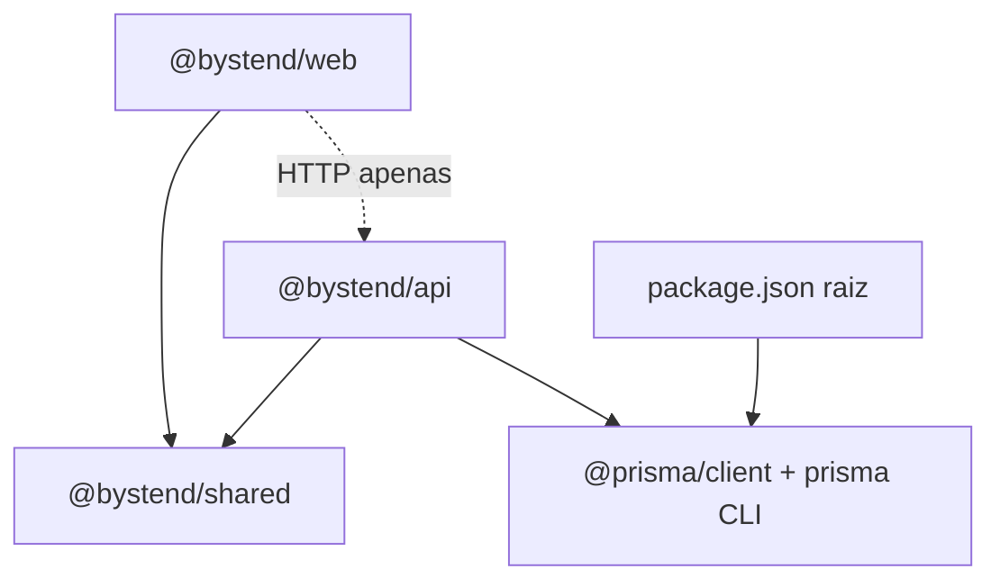

# Análise do Monorepo

## Árvore de diretórios (raiz)

```
bystend-platform/
├── apps/
│   ├── api/          # Backend Express REST
│   └── web/          # Frontend Next.js
├── packages/
│   └── shared/       # Tipos e constantes compartilhados
├── prisma/
│   └── schema.prisma # Schema único do banco
├── docs/
│   └── architecture/ # Esta documentação
├── .cursor/
│   ├── rules/        # Regras para agentes
│   └── plano_*.md   # Plano MVP histórico
├── package.json      # Workspaces + scripts raiz
├── package-lock.json
├── tsconfig.base.json
├── .env.example
├── README.md
└── APRESENTACAO.md
```

**Nota:** pasta `data/` com CSVs **não está versionada** — referenciada via `CSV_DATA_DIR`.

## Workspaces npm

Definidos em `package.json` raiz:

```json
"workspaces": ["apps/*", "packages/*"]
```

| Pacote | Nome npm | Tipo |
|--------|----------|------|
| `apps/api` | `@bystend/api` | Aplicação backend |
| `apps/web` | `@bystend/web` | Aplicação frontend |
| `packages/shared` | `@bystend/shared` | Biblioteca interna |

## Scripts raiz

| Script | Ação |
|--------|------|
| `dev` | `concurrently` API (4000) + Web (3000) |
| `build` | `shared` → `api` → `web` (ordem fixa) |
| `db:generate` | `prisma generate` na raiz |
| `db:push` | `prisma db push` (sync schema → DB) |
| `db:seed` | `npm run seed -w @bystend/api` |
| `postinstall` | `prisma generate` automático |

## Responsabilidade de cada pasta

| Pasta | Por que existe |
|-------|----------------|
| `apps/web` | UI pública, SSR/CSR, consumo da API |
| `apps/api` | Regras de busca, chat, persistência, seed |
| `packages/shared` | Contratos TypeScript estáveis entre web e api |
| `prisma/` | Fonte única de verdade do modelo relacional |
| `.cursor/` | Governança de IA e plano de produto |

## Dependências internas



- **Web → API:** apenas runtime via `fetch` (`NEXT_PUBLIC_API_URL`), não dependência npm
- **API e Web → shared:** `"@bystend/shared": "*"` no `package.json` de cada app
- **Prisma:** declarado na **raiz** e em `apps/api`; client gerado na instalação raiz

## Organização arquitetural

Padrão **modular monolith distribuído em dois deployables**:

1. **Presentation:** Next App Router
2. **Application/API:** Express routers + services
3. **Domain types:** shared package (parcial — não é DDD completo)
4. **Infrastructure:** Prisma + SQLite + integração Gemini

Não há camada `domain/` explícita; lógica de negócio está em `services/` e parcialmente em `routes/`.

## Acoplamentos identificados

| Acoplamento | Severidade | Descrição |
|-------------|------------|-----------|
| Web ↔ API contract | Média | Tipos duplicados inline nas pages; shared cobre só chat/search parcial |
| API ↔ Prisma schema | Alta | Services importam modelos diretamente |
| Seed ↔ nomes de CSV | Alta | Filenames hardcoded em `seed/csv.ts` |
| Chat ↔ search | Média | RAG reutiliza `searchContents` |
| shared ↔ LAYER_DEFINITIONS | Baixa | Camadas duplicadas no seed DB e no shared |

## Vantagens da estrutura

- Onboarding rápido: um `npm install`, um banco, dois processos
- Tipos compartilhados para respostas de chat/quiz
- Prisma centralizado evita schemas divergentes
- API testável independentemente do Next

## Desvantagens

- Sem ferramenta de monorepo (Turborepo/Nx) — cache de build manual
- Prisma na raiz mas consumido só pela API — web não acessa DB (correto), mas pode confundir
- Path aliases diferentes (`@/*` no web, nenhum no api além de extensões `.js`)
- Build da API exige `.js` nos imports ESM (`import ... from "./x.js"`)

## Hipótese: evolução esperada

O plano em `.cursor/plano_byst.end_mvp_1339670d.plan.md` sugere embeddings, admin e trilhas por público — provavelmente novos packages (`packages/embeddings`) ou rotas admin em `apps/api` sem quebrar o split atual.
