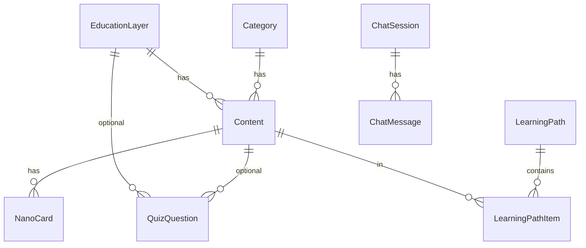

# Arquitetura Prisma

## Localização

- **Schema:** `prisma/schema.prisma` (raiz do monorepo)
- **CLI:** invocada da raiz (`npm run db:*`)
- **Client:** `@prisma/client` gerado no `node_modules` raiz
- **Consumidor único:** `apps/api/src/lib/prisma.ts`

## Datasource

```prisma
datasource db {
  provider = "sqlite"
  url      = env("DATABASE_URL")
}
```

## Generator

```prisma
generator client {
  provider = "prisma-client-js"
}
```

## Estratégia de migração

| Abordagem | Status |
|-----------|--------|
| `prisma migrate` | **Não usado** — pasta `migrations/` ausente |
| `prisma db push` | **Usado** — sync direto schema → DB |
| Seed | Script custom `apps/api/src/seed/index.ts` |

**Implicação:** histórico de schema não versionado em SQL; adequado para MVP/hackathon, arriscado para produção.

## Singleton do client (`lib/prisma.ts`)

```typescript
const globalForPrisma = globalThis as unknown as { prisma: PrismaClient };
export const prisma = globalForPrisma.prisma ?? new PrismaClient({...});
if (process.env.NODE_ENV !== "production") globalForPrisma.prisma = prisma;
```

Padrão hot-reload dev (evita múltiplas conexões com `tsx watch`).

## Modelos — resumo

| Model | Papel |
|-------|-------|
| `Category` | Taxonomia por tipo de violência/tema |
| `EducationLayer` | 8 camadas metodológicas |
| `Content` | Entidade central (vídeo, nano, micro, seasonal, etc.) |
| `NanoCard` | Cards curtos 1:N com Content |
| `Slogan` | Frases curtas (tabela separada, nem sempre ligada a Content) |
| `LearningPath` | Trilha educativa |
| `LearningPathItem` | N:N ordenado path↔content |
| `QuizQuestion` | Perguntas; `options` JSON string |
| `UserProgress` | Sessão anônima + quiz scores |
| `ChatSession` | Sessão de chat por `sessionId` string |
| `ChatMessage` | Histórico user/assistant + `sources` JSON |

## Relações principais



## Indexes declarados

| Model | Index |
|-------|-------|
| `Content` | `type`, `violenceType`, `theme` |
| `NanoCard` | `contentId` |
| `ChatMessage` | `sessionId` |

**Ausente:** index em `Content.searchText` — busca faz scan em memória após `take: 200`.

## Campos JSON serializados em String

SQLite + Prisma: campos complexos como **string JSON**:

| Campo | Model | Conteúdo |
|-------|-------|----------|
| `options` | QuizQuestion | `string[]` |
| `metadata` | Content | objeto seed |
| `sources` | ChatMessage | `ChatSource[]` |
| `completedIds` | UserProgress | default `"[]"` |

## Tipos não enum no schema

`Content.type`, `audience`, `violenceType`, `sensitivity`, `legalRisk` são **String** livres — validação apenas na aplicação/seed.

## Fluxo de acesso típico

1. Route valida query/body (Zod)
2. Service ou route chama `prisma.*`
3. `include` para relações (layer, category, nanoCards)
4. JSON response direto (sem DTO layer)

## Seed e Prisma

`seed/index.ts` executa **delete em cascata lógica** (ordem respeitando FKs) antes de reinserir:

```
chatMessage → chatSession → userProgress → quiz → path items → paths →
nano → slogan → content → layers → categories
```

## Geração do client

- `postinstall`: `prisma generate`
- API importa `@prisma/client` (dependência duplicada em api + root — npm hoisting)

## Riscos Prisma-específicos

| Risco | Detalhe |
|-------|---------|
| `db push` em prod | Sem rollback automático |
| String JSON | Parse manual (`JSON.parse`) pode falhar |
| SQLite locks | Concorrência baixa em chat/quiz simultâneo |
| Path DB | `.env.example` usa `file:./dev.db` na raiz; README menciona `prisma/dev.db` — **inconsistência documental** |

## Hipótese de deploy futuro

Trocar `provider` para `postgresql` exigiria ajustar `DATABASE_URL` e possivelmente enums; lógica Prisma permanece compatível.
