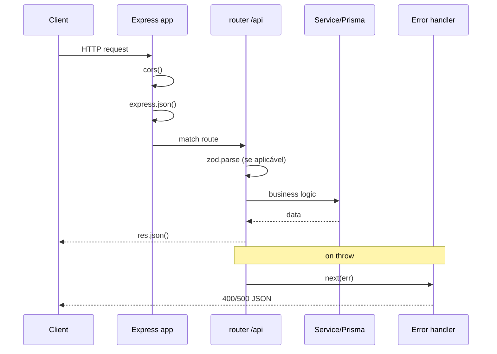
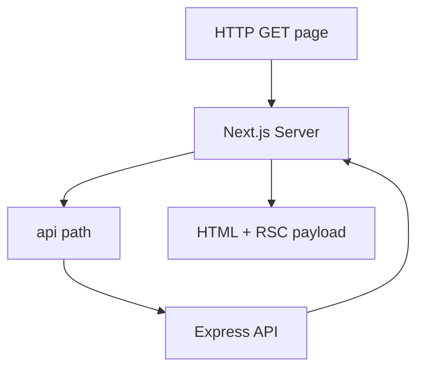

# Ciclo de Vida das Requisições

## API Express — fluxo global



### Entry (`apps/api/src/index.ts`)

1. Load env
2. Middleware stack
3. Mount `/api` router
4. Listen

**Não há** middleware de request-id, timeout ou helmet.

## Por tipo de rota

### GET read-only (ex: `/contents`)

| Etapa | Ação |
|-------|------|
| 1 | Parse query com Zod |
| 2 | Montar objeto `where` Prisma |
| 3 | `findMany` + `count` paralelo (`Promise.all`) |
| 4 | `res.json({ items, total })` |

Erros Prisma → 500 genérico.

### GET `/search`

| Etapa | Ação |
|-------|------|
| 1 | Zod query |
| 2 | `searchContents()` — fetch 200, score, slice |
| 3 | `{ query, results }` |

### POST `/chat`

| Etapa | Ação |
|-------|------|
| 1 | Zod `{ message, sessionId }` |
| 2 | `retrieveContextForQuery` |
| 3 | `formatContextForPrompt` |
| 4 | `searchContents` (paralelo para highRisk) |
| 5 | Gemini ou fallback |
| 6 | Upsert session + 2× insert messages |
| 7 | `ChatResponse` JSON |

Latência dominada por **chamada Gemini** + múltiplas queries SQLite.

### POST `/quiz/answer`

| Etapa | Ação |
|-------|------|
| 1 | Zod body |
| 2 | `findUnique` question |
| 3 | Comparar `selectedIndex` vs `correctIndex` |
| 4 | Opcional `userProgress.upsert` |
| 5 | `{ correct, explanation, relatedContentIds }` |

## Formato de erro padronizado

```json
{ "error": "Dados inválidos", "details": [...] }  // 400 Zod
{ "error": "Conteúdo não encontrado" }               // 404 manual
{ "error": "Erro interno do servidor" }            // 500
```

Alinhado a `.cursor/rules/bystend.mdc`.

## Frontend — Server Components



- `cache: "no-store"` — sempre dados frescos ou vazio se API down
- `searchParams` / `params` como `Promise` (Next 15)

## Frontend — Client Components

Páginas: `/busca`, `/chat`, `/quiz`

| Etapa | Ação |
|-------|------|
| 1 | Evento usuário |
| 2 | `setState` loading |
| 3 | `api()` fetch |
| 4 | Atualizar state / render |
| 5 | Tratamento erro genérico (mensagem amigável) |

**Sem** React Query/SWR — estado local apenas.

## CORS preflight

`cors({ origin: true })` reflete Origin do browser — funciona com Next em `:3000` → API `:4000`.

## Cache

| Camada | Cache |
|--------|-------|
| Next fetch | Desabilitado (`no-store`) |
| API | Nenhum |
| Prisma | Query cache default |
| CDN | N/A |

## Filas, eventos, workers

**Não existem.** Chat é síncrono end-to-end.

## Cron jobs

**Não existem.** Conteúdo sazonal filtrado por mês no request (`/seasonal`).

## Health check

`GET /api/health` → `{ status: "ok", service: "bystend-api" }`

Usado para verificar API em dev; web não consome automaticamente.
