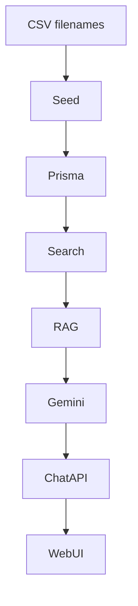

# Riscos Arquiteturais

## Matriz de riscos

| ID | Risco | Prob. | Impacto | Mitigação atual |
|----|-------|-------|---------|-----------------|
| R-01 | Abuso API chat (custo Gemini) | Média | Alto | Nenhuma |
| R-02 | Vazamento DB SQLite local | Baixa | Alto | .gitignore; sem PII by design |
| R-03 | Conteúdo LLM fora do guardrail | Média | Alto | Prompt + fallback; sem moderação output |
| R-04 | Perda dados ao re-seed | Alta* | Médio | *Só em dev; seed destrutivo |
| R-05 | Busca irrelevante em queries longas | Alta | Médio | Tokenização simples |
| R-06 | Drift contrato web/API | Média | Médio | shared parcial |
| R-07 | SQLite lock sob carga | Baixa MVP | Médio | Aceito no MVP |
| R-08 | Filename CSV muda | Média | Alto seed | Strings fixas |
| R-09 | Dependência modelo Gemini | Média | Médio | Multi-model retry |
| R-10 | Deploy sem variáveis env | Média | Alto | .env.example |

## Riscos de produto / compliance

| Risco | Descrição |
|-------|-----------|
| **Parecer jurídico implícito** | Usuário pode interpretar chat como consultoria legal |
| **Relatos reais em chat** | Armazenados em SQLite sem política de retenção |
| **Disclaimer insuficiente** | Presente, mas usuário pode ignorar |
| **Alto risco jurídico mal classificado** | Depende de CSV/seed; heurística `isHighLegalRisk` string-based |

## Riscos de acoplamento

Quebra em CSV → dados vazios → busca/RAG/chat degradados em cadeia.

## Gargalos de performance

| Cenário | Gargalo |
|---------|---------|
| Biblioteca grande | `findMany` com includes |
| Busca concorrente | CPU scoring + 200 rows |
| Chat popular | Gemini latency + DB writes |
| Seed completo | I/O CSV + milhares de inserts |

## Riscos operacionais

- **Sem CI/CD** no escopo documentado
- **Sem backup** automatizado do `.db`
- **Dois serviços** para deploy (web + api)
- **postinstall prisma generate** pode falhar em ambientes restritos

## Riscos de segurança

| Vetor | Estado |
|-------|--------|
| AuthN/AuthZ | Ausente |
| Input sanitization | Zod length apenas |
| SQL injection | Mitigado por Prisma parametrizado |
| XSS | React escapa; `body` content exibido como texto |
| CSRF | API stateless JSON; menor risco |
| Secrets no client | Apenas `NEXT_PUBLIC_API_URL` |

## Plano de mitigação sugerido (pós-MVP)

1. Rate limiting no `/chat` e `/search`
2. Migrations + Postgres gerenciado
3. Embeddings + avaliação de qualidade RAG
4. Política de retenção chat (TTL delete)
5. OpenAPI spec + client gerado
6. Testes de regressão em `normalize` e `search`

## Sinais de alerta em produção

- Latência p95 `/chat` > 10s
- Erros Gemini em loop (logs "trying next model")
- DB file > centenas de MB (histórico chat)
- Seed warn "CSV not found" em deploy
