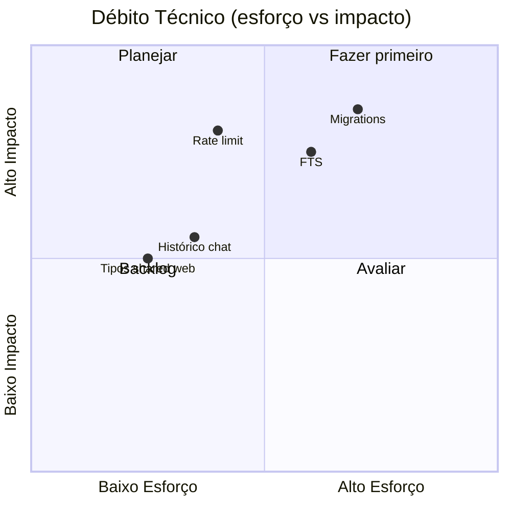

# Débito Técnico

Itens identificados por engenharia reversa — prioridade sugerida para evolução pós-MVP.

## Alto impacto

| ID | Débito | Evidência | Sugestão |
|----|--------|-----------|----------|
| TD-01 | Sem migrations Prisma | Só `db push` | Adotar `prisma migrate` antes de prod |
| TD-02 | API pública sem rate limit | `cors({ origin: true })`, rotas abertas | Rate limit + API key no chat |
| TD-03 | Busca não escala | `take: 200` + score JS | FTS SQLite ou embeddings |
| TD-04 | README desatualizado sobre LLM | README vs `chat.ts` | Alinhar documentação |
| TD-05 | `DATABASE_URL` inconsistente | README vs `.env.example` | Padronizar path do `.db` |

## Médio impacto

| ID | Débito | Evidência | Sugestão |
|----|--------|-----------|----------|
| TD-06 | Tipos duplicados no web | Interfaces inline nas pages | Importar `@bystend/shared` |
| TD-07 | `routes/index.ts` monolítico | ~250 linhas | Split por domínio |
| TD-08 | Progresso trilha fake | `completed = 0` em `trilha/page.tsx` | GET progress + PATCH |
| TD-09 | Chat não mostra histórico | DB persiste, UI não lê | GET `/chat/history` |
| TD-10 | RAG N+1 queries | `rag-context.ts` loop findUnique | Single query `where id in` |
| TD-11 | Web não usa shared types | Só transpile config | Imports reais |
| TD-12 | Sem testes | Nenhum `*.test.*` | Unit search/normalize; e2e críticos |

## Baixo impacto

| ID | Débito | Evidência | Sugestão |
|----|--------|-----------|----------|
| TD-13 | Path hardcoded seed | `C:\Users\lrzezak\Downloads` | Remover ou env only |
| TD-14 | `void progress` quiz | routes quiz answer | Usar ou remover upsert |
| TD-15 | Duplo dotenv load | `index.ts` | Um único load |
| TD-16 | `OPENAI_API_KEY` morta | .env.example | Remover ou implementar |
| TD-17 | Slogans em tabela separada | Nem sempre expostos na biblioteca | Unificar ou endpoint |
| TD-18 | Sem `middleware.ts` Next | — | Headers segurança se necessário |

## Débito de produto (documentado)

Fonte: `README.md` limitações

- Embeddings não implementados
- Admin de conteúdos ausente
- Trilhas por público (líderes, RH) ausentes
- Progresso trilha demonstrativo

## Débito de observabilidade

- Logs apenas `console.*`
- Sem métricas, tracing, APM
- Sem health check integrado ao web

## Estimativa de esforço (relativa)

## Código morto / subutilizado

| Item | Status |
|------|--------|
| `OPENAI_API_KEY` | Não usado |
| `UserProgress.pathId`, `completedIds` | Campos pouco usados |
| `packages/shared` no web | Quase não importado |
| Plano `.cursor/plano_*` | Histórico, não runtime |
