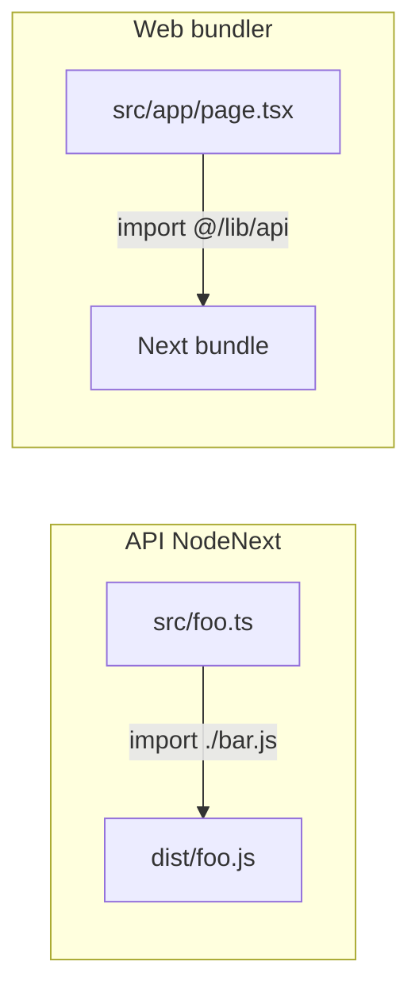

# Arquitetura TypeScript

## Configuração base (`tsconfig.base.json`)

| Opção | Valor | Efeito |
|-------|-------|--------|
| `target` | ES2022 | Emit moderno |
| `module` | NodeNext | ESM com extensões `.js` nos imports |
| `moduleResolution` | NodeNext | Resolução Node16+ |
| `strict` | true | Null safety, etc. |
| `declaration` | true | `.d.ts` para shared |
| `sourceMap` | true | Debug |

**Não define** `paths` na base — cada app estende localmente.

## Por workspace

### `packages/shared/tsconfig.json`

- `extends` base
- `outDir: ./dist`, `rootDir: ./src`
- Build produz `index.js` + `index.d.ts`

### `apps/api/tsconfig.json`

- `extends` base
- `outDir: ./dist`, `rootDir: ./src`
- **Imports relativos com sufixo `.js`** (requisito NodeNext):

```typescript
import { router } from "./routes/index.js";
```

### `apps/web/tsconfig.json`

- **Não estende** `tsconfig.base.json` — config independente Next
- `module: esnext`, `moduleResolution: bundler`
- `noEmit: true` (Next compila)
- `jsx: preserve`
- **Path alias:**

```json
"paths": { "@/*": ["./src/*"] }
```

Uso: `import { Nav } from "@/components/Nav"`

## Estratégia de build

| Pacote | Ferramenta | Output |
|--------|------------|--------|
| shared | `tsc` | `packages/shared/dist/` |
| api | `tsc` | `apps/api/dist/` |
| web | `next build` | `.next/` |

Script raiz `build` força ordem: **shared → api → web**.

## Tipos compartilhados vs locais

| Origem | Onde |
|--------|------|
| `@bystend/shared` | API services, seed layers, chat response |
| Inline nas pages | `ContentItem`, `SearchResult`, `QuizQuestion` no web |
| Prisma gerado | `@prisma/client` types (só API) |
| Zod infer | Não usado (`z.infer`) — validação sem tipos exportados |

**Gap:** não há codegen web↔api; contratos JSON são informais.

## Module resolution — API vs Web



## `next.config.ts`

```typescript
transpilePackages: ["@bystend/shared"]
```

Permite importar shared no web mesmo sem publicar npm — necessário se o web passar a importar tipos do source.

## Strictness e `any`

Regra do projeto: evitar `any`. Código atual usa casts pontuais:

- `as SearchResult["type"]`
- `as Record<string, string>[]` no CSV parse

## Arquivos de ambiente TS

- `apps/web/next-env.d.ts` — referências Next
- Sem `paths` para `@bystend/shared` no web (import via nome de pacote workspace)

## Recomendações para novas features

1. Novos contratos API → adicionar em `packages/shared/src/index.ts`
2. Novos módulos API → imports com `.js`
3. Novos componentes web → alias `@/`
4. Schemas Zod repetidos → considerar extrair para shared (futuro)
